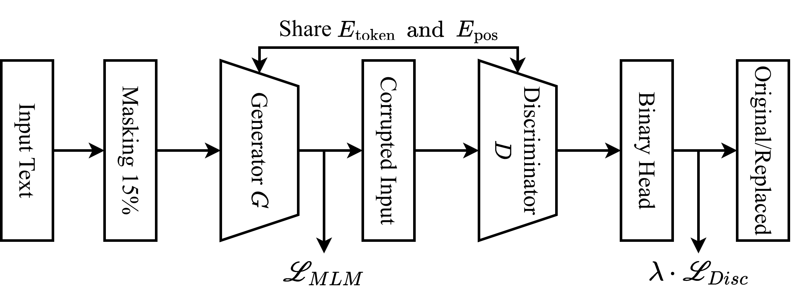

# The code is not completed yet, just implement the main model in quarter generator variant

The Architecture



# Download the corpus

```bash
pip install gdown

gdown --folder https://drive.google.com/drive/folders/1x9bP8J1vf3GdSyjZzaDpvH39YM3tI0qn -O corpus
```

The corpus must follow this working directory:

```
CKTN-ELECTRA/
    ├── corpus/   <- Our corpus
    │   ├── dev/
    │   │   ├── cham_dev.json
    │   │   ├── khmer_dev.json
    │   │   └── tay_nung_dev.json
    │   └── train/
    │   │   ├── cham_train.json
    │   │   ├── khmer_train.json
    │   │   └── tay_nung_train.json
    ├── half_and_no_linear_lambda_variant/
    ├── half_generator_variant/
    ├── quarter_and_no_linear_lambda_variant/
    ├── quarter_generator_variant/   <- Main model
    ├── raw_raviant/
    ├── venv/
    ├── .env   <- Put HF key here
    ├── .gitignore
    ├── README.md
    ├── requirements.txt
    └── run.sh
```

# Training Instruction:

1. Create .env and put HF key to .env file

```env
HUGGINGFACE_HUB = "YOUR_HF_KEY"
```

2. Create Virtual Environment

```bash
python3 -m venv venv
source venv/bin/activate
```

3. Install dependencies

```bash
pip install -r requirements.txt
```

4. Train the main model

```bash
python quarter_generator_variant/training.py --batch_size YOUR-BATCHSIZE
```

YOUR-BATCHSIZE depends on your GPU memory available

5. After finish training, push to huggingface

```bash
python quarter_generator_variant/push_to_hub.py
```