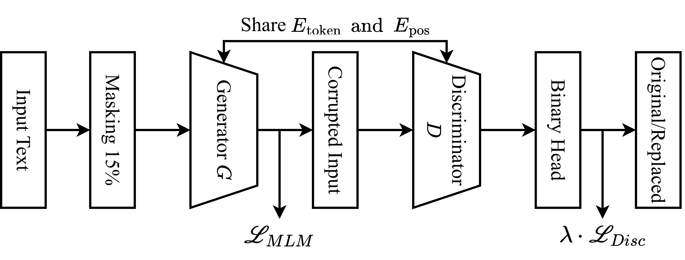

# The code is not completed yet, just implement the main model in quarter generator variant

The Architecture



# Download the corpus

```bash
pip install gdown

gdown --folder https://drive.google.com/drive/folders/1x9bP8J1vf3GdSyjZzaDpvH39YM3tI0qn -O corpus
```

The corpus must follow this working directory:

```
CKTN-ELECTRA/
    ├── corpus/   <- Our corpus
    │   ├── dev/
    │   │   ├── cham_dev.json
    │   │   ├── khmer_dev.json
    │   │   └── tay_nung_dev.json
    │   └── train/
    │       ├── cham_train.json
    │       ├── khmer_train.json
    │       └── tay_nung_train.json
    ├── half_and_no_linear_lambda_variant/
    ├── half_generator_variant/
    ├── quarter_and_no_linear_lambda_variant/
    ├── quarter_generator_variant/   <- Main model
    ├── raw_raviant/
    ├── venv/
    ├── .env   <- Put HF key here
    ├── .gitignore
    ├── README.md
    ├── requirements.txt
    └── run.sh
```

# Training Instruction:

1. Create .env and put HF key to .env file

```env
HUGGINGFACE_HUB = "YOUR_HF_KEY"
```

2. Create Virtual Environment

```bash
python3 -m venv venv
source venv/bin/activate
```

3. Install dependencies

```bash
pip install -r requirements.txt
```

4. Build the tokenized chunk cache once

```bash
python quarter_generator_variant/prepare_cache.py
```

If you change corpus files or tokenizer settings and want to force a rebuild:

```bash
python quarter_generator_variant/prepare_cache.py --rebuild_cache
```

5. Train the main model

```bash
python quarter_generator_variant/training.py --batch_size YOUR-BATCHSIZE
```

YOUR-BATCHSIZE depends on your GPU memory available

Training reuses matching cached chunks automatically. To force cache rebuild from
the training command:

```bash
python quarter_generator_variant/training.py --batch_size YOUR-BATCHSIZE --rebuild_cache
```

To resume from the latest saved epoch checkpoint:

```bash
python quarter_generator_variant/training.py --batch_size YOUR-BATCHSIZE --resume latest
```

6. After finish training, push to huggingface

```bash
python quarter_generator_variant/push_to_hub.py
```

# Downstream fine-tuning

Category classification:

```bash
python quarter_generator_variant/train_category_classification.py
```

Information retrieval:

```bash
python quarter_generator_variant/train_information_retrieval.py
```

Benchmark model keys:

```text
cktn    -> ducanhdinh/CKTN-ELECTRA
cktn_original -> ducanhdinh/CKTN-ELECTRA-original
mbert   -> google-bert/bert-base-multilingual-cased
xlmr    -> FacebookAI/xlm-roberta-base
rembert -> google/rembert
```

Category classification benchmarks:

```bash
for model in cktn cktn_original mbert xlmr rembert; do
  python quarter_generator_variant/train_category_classification.py \
    --model_key "$model" \
    --pooling cls
done
```

Category classification benchmarks with mean pooling:

```bash
for model in cktn cktn_original mbert xlmr rembert; do
  python quarter_generator_variant/train_category_classification.py \
    --model_key "$model" \
    --pooling mean
done
```

Information retrieval benchmarks:

```bash
for model in cktn cktn_original mbert xlmr rembert; do
  python quarter_generator_variant/train_information_retrieval.py \
    --model_key "$model"
done
```

Each benchmark writes to a model-specific output directory under
`quarter_generator_variant/downstream/`.

Default downstream hyper-parameters:

```python
MAX_SEQ_LEN      = 512
NUM_EPOCHS       = 5
GRAD_ACCUM_STEPS = 1
WARMUP_RATIO     = 0.06
WEIGHT_DECAY     = 0.01
MAX_GRAD_NORM    = 1.0
SEED             = 42

# Category classification
BATCH_SIZE       = 32
LEARNING_RATE    = 1e-4

# Information retrieval
BATCH_SIZE       = 16
EVAL_BATCH_SIZE  = 16
LEARNING_RATE    = 2e-5
```

If GPU memory is insufficient, lower `--batch_size` and increase
`--grad_accum_steps`.

Category classification prints label-map and class-distribution diagnostics at
startup. It uses balanced class-weighted cross-entropy by default; pass
`--class_weighting none` to disable it. Use `--pooling cls` for first-token
pooling or `--pooling mean` for masked mean pooling over the sequence.

Both scripts load the best continued-pretraining discriminator checkpoint by default:

```bash
quarter_generator_variant/checkpoint/discriminator/discriminator_best.pt
```
